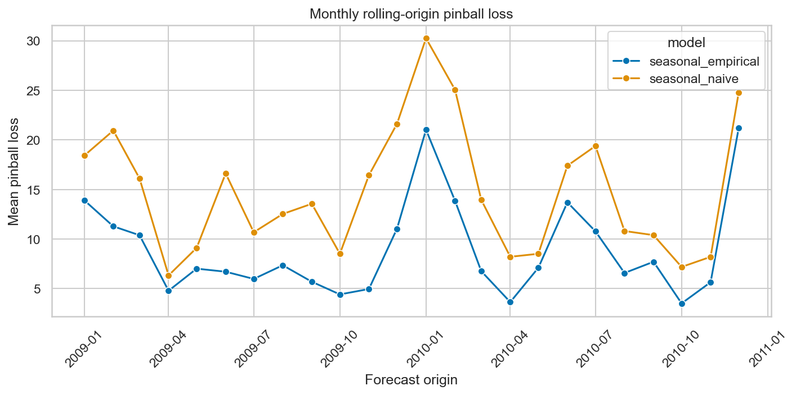
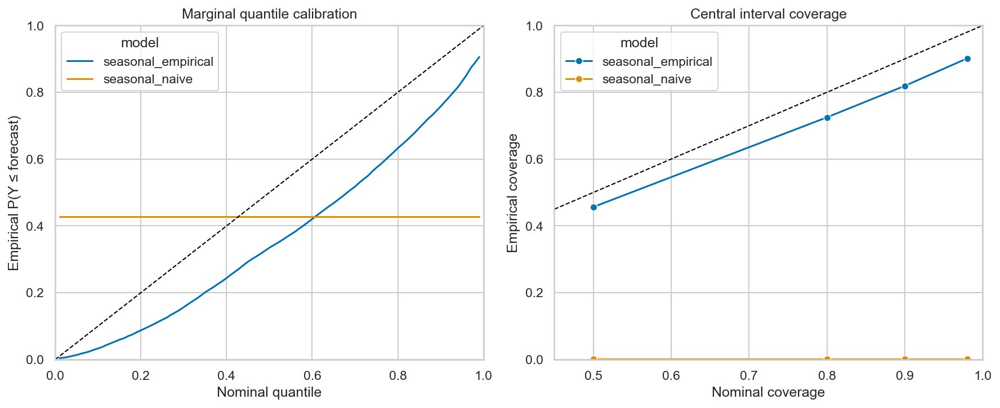

# GEFCom2014 load baseline evaluation

## Executive summary

Two calendar-only baselines were evaluated over 24 monthly rolling-origin
validation folds from January 2009 through December 2010. The official
seasonal-naive benchmark repeats the same calendar hour one year earlier at all
99 quantiles. The seasonal empirical baseline pools the same operating hour and
weekday/weekend type within an inclusive ±8-day window around the corresponding
date in every completed prior seasonal cycle.

The seasonal empirical forecast reduces hour-weighted pinball loss from 14.752
to 8.955, a 39.3% improvement. It wins all 24 paired monthly folds; the exact
two-sided sign-test p-value is 1.19e-7. The improvement is large and consistent,
but the empirical forecast remains biased low and under-covers its nominal
intervals. Its nominal 90% interval contains 81.9% of validation outcomes.

The configured January–December 2011 test split was not run while developing
this baseline.

## Forecast definitions

Both baselines use operating interval starts, obtained by subtracting one hour
from the competition's hour-ending timestamps.

**Seasonal naive.** For target operating hour `t`, use the load at `t` minus one
calendar year and repeat that value for quantiles 0.01 through 0.99. This exactly
reproduces the benchmark supplied in the official Task 1–15 files.

**Seasonal empirical.** For every target operating hour:

1. Centre an inclusive ±8-calendar-day window on the same month and day in each
   earlier seasonal cycle.
2. Retain the same zone and operating hour.
3. Retain weekdays for weekday targets and weekends for weekend targets.
4. Pool every available candidate from those previous cycles.
5. Calculate quantiles 0.01 through 0.99 using linear interpolation.

The windows are anchored in earlier cycles rather than selected using only a
`timestamp < origin` condition. Consequently, an immediately preceding month
from the current seasonal cycle cannot enter the forecast. Year-end windows
remain complete: a window centred in late December 2009 may contain observations
from early January 2010 when forecasting late December 2010.

Neither baseline uses target-month temperature, observed target load, holiday
labels, or any fitted preprocessing.

## Rolling-origin validation

The shared [backtest configuration](../../configs/backtest.yaml) defines the
half-open validation interval `[2009-01-01, 2011-01-01)`. Each calendar month is
forecast in one batch using only observations whose operating interval starts
before the first hour of that month. Actuals are revealed only when constructing
the next monthly fold.

This produces 24 non-overlapping folds and 17,520 target hours. The first origin
has four complete years of prior load, beginning on 1 January 2005. Training
history grows from 35,064 hours at the January 2009 origin to 51,840 hours at the
December 2010 origin. The complete boundaries are in
[`fold_manifest.csv`](validation/fold_manifest.csv).

For arbitrary pre-competition origins, all outcomes are loaded as a retrospective
label store and then sliced anew at every origin. Forecast functions receive the
pre-origin snapshot and target calendar columns, but not the target `load`
column. Tests additionally assert that training ends strictly before each
origin.

## Validation results

Pinball loss is averaged over all 99 quantiles and target hours; lower is better.
The hour-weighted score is the primary competition-style result. The equal-month
mean and standard deviation show variation across folds. Median bias is defined
as `actual - q0.50`, so a positive value denotes under-forecasting.

| Model | Pinball loss | Monthly mean ± SD | Median MAE | Median bias | Mean absolute calibration error |
|---|---:|---:|---:|---:|---:|
| Seasonal empirical | **8.955** | 8.959 ± 4.895 | 24.99 | +15.41 | 0.138 |
| Seasonal naive | 14.752 | 14.790 ± 6.474 | 29.50 | +7.04 | 0.253 |

The empirical baseline's monthly pinball loss ranges from 3.511 in October 2010
to 21.208 in December 2010. January 2010 is nearly as difficult at 21.020. The
empirical baseline nevertheless beats the seasonal naive in every fold. Its
mean paired improvement is 5.831 pinball-loss units, with a standard deviation
of 3.210 across months. Full results are in
[`aggregate_metrics.csv`](validation/aggregate_metrics.csv),
[`fold_metrics.csv`](validation/fold_metrics.csv), and
[`paired_comparison.csv`](validation/paired_comparison.csv).



## Calibration and sharpness

| Model | Nominal interval | Empirical coverage | Mean width (MW) |
|---|---:|---:|---:|
| Seasonal empirical | 50% | 45.6% | 32.81 |
| Seasonal empirical | 80% | 72.5% | 60.12 |
| Seasonal empirical | 90% | 81.9% | 74.29 |
| Seasonal empirical | 98% | 90.1% | 92.86 |
| Seasonal naive | 90% | 0.15% | 0.00 |

The empirical quantile curve lies mostly below the ideal diagonal. In
particular, only 33.5% of observations are below its predicted median. This is
consistent with its +15.41 MW median bias: pooling older historical years does
not follow the higher load level in parts of the validation period. Its
intervals are also too narrow for their nominal levels. The seasonal naive is a
degenerate distribution, so all central intervals have zero width and cover an
outcome only when the previous-year load happens to match it exactly.

No quantile crossings occur for either model. Detailed marginal and interval
results are in [`quantile_calibration.csv`](validation/quantile_calibration.csv)
and [`interval_calibration.csv`](validation/interval_calibration.csv).



## Candidate-pool size and limitations

Seasonal empirical candidate pools range from 16 to 65 observations per target
hour. Typical fold medians rise from 46–47 observations in 2009 to 59–60 in
2010 as another historical cycle becomes available. Weekend targets have the
smallest pools. Linear interpolation produces all 99 requested quantiles, but it
does not create additional tail evidence; the 1st and 99th percentiles are
therefore especially uncertain.

Other limitations are:

- Weekdays are pooled together, with no separate Monday/Friday or holiday type.
- Older cycles receive the same weight as recent cycles despite changes in load
  level.
- Weather is intentionally omitted, so unusual hot and cold periods cannot be
  anticipated.
- Forecasts provide only marginal hourly quantiles and do not define coherent
  joint hourly scenarios.

## Reproduction and artifacts

From the repository root, run:

```bash
.venv/bin/python -m pytest
.venv/bin/python -m analysis.baseline.run
```

The runner defaults to the validation split. It reads the model parameters from
[`configs/baseline.yaml`](../../configs/baseline.yaml), writes a resolved
configuration alongside the results, and saves compressed per-hour forecasts
in [`predictions.csv.gz`](validation/predictions.csv.gz). The implementation is
kept in the compact reusable modules
[`backtesting.py`](../../src/gefcom2014/backtesting.py),
[`baselines.py`](../../src/gefcom2014/baselines.py),
[`evaluation.py`](../../src/gefcom2014/evaluation.py), and
[`metrics.py`](../../src/gefcom2014/metrics.py).
