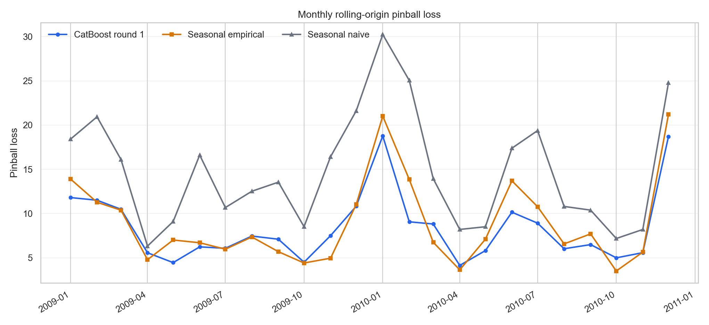
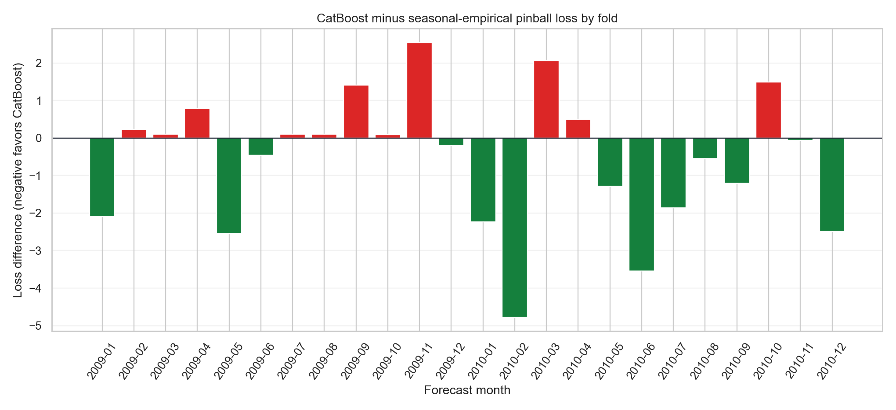
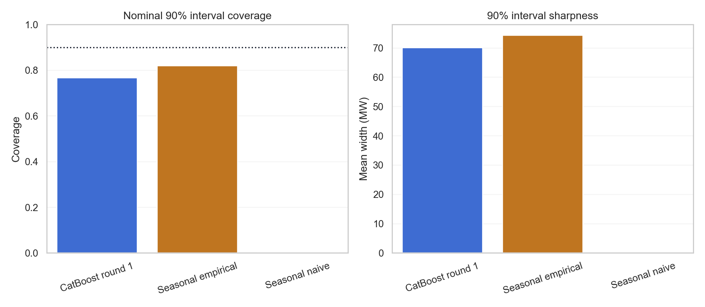
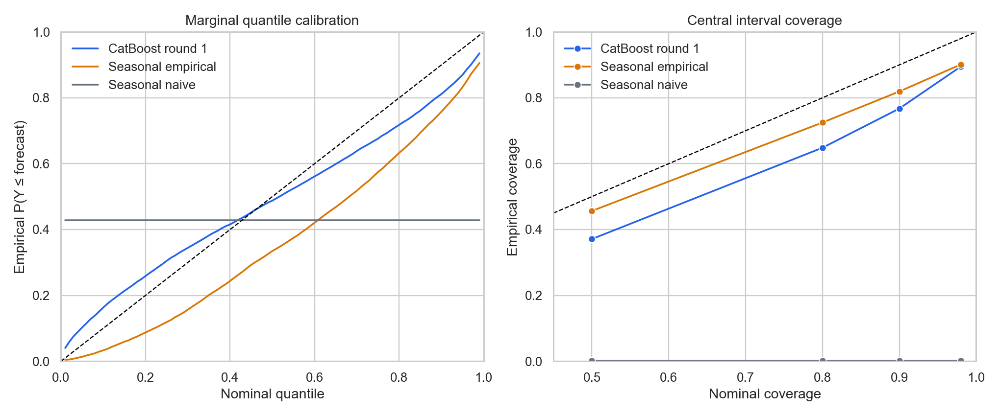
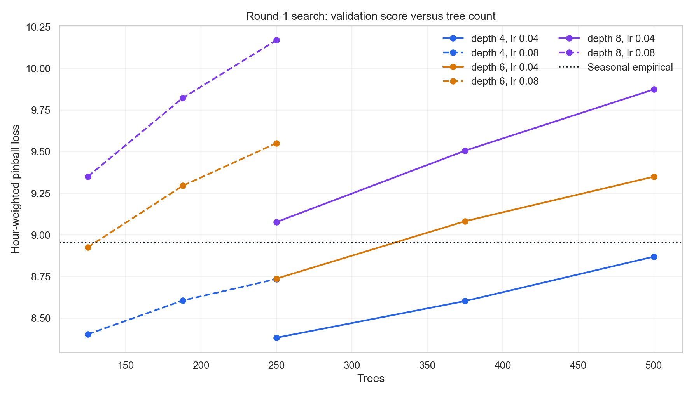

# CatBoost round-1 validation report

## Executive summary

The first-round model is a CPU CatBoost `MultiQuantile` regressor trained to
predict all 99 requested load quantiles jointly from the 45 leakage-safe
features in [`first_round.yaml`](../../../configs/features/first_round.yaml).
All 18 effective hyperparameter candidates were evaluated on the same 24
monthly rolling-origin validation folds from January 2009 through December 2010. The configured 2011 test period was not accessed.

The selected configuration is **depth 4, learning rate 0.04, L2 leaf
regularization 5, and 250 trees**. It obtains an hour-weighted pinball loss of
**8.382**, compared with
**8.955** for the seasonal empirical baseline—a
**6.39%** reduction. It
also reduces median MAE from 24.99 to
23.17 MW and median under-forecast bias from
+15.41 to
+6.03 MW.

This aggregate improvement is promising but not yet robust. CatBoost wins only
13 of 24 months against the empirical
baseline. The mean difference is not significant in either the HAC
loss-differential test (p=0.106)
or the exact paired sign test (p=0.839).
Performance is virtually tied in 2009 and substantially better in 2010. Since
the model was selected from 18 candidates using these same folds, all
inferential results are exploratory; the untouched test period is needed for a
credible final confirmation.

A post-hoc 2010-only comparison is consistent with the hypothesis that the
model benefits from the additional accumulated history. CatBoost improves the
empirical baseline by 11.22%, and the HAC mean-loss test gives p=0.0329.
However, the sign test gives p=0.146, and the subgroup was examined after the
year-level results were known, so this result is suggestive rather than
confirmatory.

Against seasonal naive, the evidence is unambiguous within validation:
CatBoost improves pinball loss by
43.18% and wins
all 24 folds.

## Experimental design and leakage protection

Each target month is treated as one forecast round. Features for every
pseudo-origin use only load and observed temperature strictly before that
month's origin; deterministic calendar and horizon information may use the
target timestamp. Realized target-month temperature is never supplied. A
pseudo-month enters a later model fit only after its `forecast_end`, so January
labels become available for the February origin but never for January itself.

The cached modeling data begins at January 2007, the earliest origin with full
support for all features. Training therefore grows from 17,544 labeled hourly
pseudo-forecast rows at the January 2009 evaluation origin to 34,320 rows at
the December 2010 origin. The first-round feature groups cover target calendar
and horizon, recent load level and trend, recent hourly/weekly profiles,
seasonal historical profiles and adjustment, annual anchors, temperature
climatology, and pre-origin recent temperature. Six calendar fields are passed
to CatBoost as categorical features.

The model directly optimizes CatBoost's joint `MultiQuantile` objective for
quantiles 0.01 through 0.99. Quantiles are evaluated exactly as emitted; no
sorting or post-hoc repair is used when calculating pinball loss.

## Round-1 feature set

The 45 features are organized into eight blocks. All load-derived and
temperature-derived values are frozen at the monthly forecast origin. Only
deterministic calendar and horizon features use the future target timestamp.
The exact feature-building parameters are stored in
[`first_round.yaml`](../../../configs/features/first_round.yaml), and the
cached feature schema is stored with the modeling-data artifact.

### Target calendar and forecast horizon (11 features)

These features identify the future operating hour and its position within the
forecast month. Hour and seasonal position are also represented cyclically.
`hour_of_week` combines weekday and hour, while `horizon_hours` and
`forecast_week` measure distance from the first hour of the target month.

Features: `hour`, `day_of_week`, `hour_of_week`, `month`, `is_weekend`,
`hour_sin`, `hour_cos`, `seasonal_day_sin`, `seasonal_day_cos`,
`horizon_hours`, and `forecast_week`.

The six categorical CatBoost inputs are `hour`, `day_of_week`,
`hour_of_week`, `month`, `is_weekend`, and `forecast_week`. Seasonal sine and
cosine use a fixed 366-day calendar, which preserves February 29 and aligns
the same month/day across years.

### Recent load level and trend (8 features)

These origin-level summaries describe the load regime immediately before the
forecast month. They include recent and annual means, short-versus-medium
level change, a linear trend in 28 daily means, and ratios to the corresponding
pre-origin periods one calendar year earlier. A requested window is used only
when its hourly history is complete.

Features: `load_mean_7d`, `load_mean_28d`, `load_mean_365d`,
`load_std_28d`, `load_mean_7d_minus_28d`, `load_daily_slope_28d`,
`load_yoy_ratio_28d`, and `load_yoy_ratio_365d`.

### Recent target-specific load profiles (5 features)

These retain daily and weekly shape that global averages discard. For each
target hour they provide the corresponding hour from the last complete day,
the most recent matching hour of week, and historical mean or variability for
the matching hour of week over complete recent windows.

Features: `load_last_day_same_hour`, `load_last_same_hour_of_week`,
`load_how_mean_4w`, `load_how_mean_12w`, and `load_how_std_12w`.

### Historical seasonal load profiles (7 features)

These are constructed from completed previous seasonal cycles only. The first
analogue pool matches target hour, weekday/weekend day type, and dates within
a circular ±8-day calendar window; its 10th, 50th, and 90th percentiles and
sample count are retained. The second, more specific pool matches exact
weekday and hour within ±15 calendar days and contributes its mean, standard
deviation, and support count.

Features: `load_seasonal_daytype_8d_q10`,
`load_seasonal_daytype_8d_q50`, `load_seasonal_daytype_8d_q90`,
`load_seasonal_daytype_8d_count`, `load_seasonal_how_15d_mean`,
`load_seasonal_how_15d_std`, and `load_seasonal_how_15d_count`.

### Recent-level seasonal adjustment (2 features)

The raw ±8-day seasonal median is adjusted to the load level observed during
the final 28 days before the origin. The model receives both the multiplicative
recent-to-seasonal ratio and the target seasonal median after applying that
ratio. Seasonal reference values for the recent 28-day period are themselves
built only from earlier cycles.

Features: `load_seasonal_level_ratio_28d` and
`load_seasonal_daytype_8d_q50_scaled_28d`.

### Annual load anchors (2 features)

Two direct historical anchors represent different definitions of “the same
hour last year.” The calendar-year lag preserves month, day, and hour but can
change weekday; the 364-day lag preserves weekday and hour because it is
exactly 52 weeks.

Features: `load_lag_calendar_1y` and `load_lag_364d`.

### Target-hour temperature climatology (5 features)

Since realized target-month temperature is unavailable at forecast time, the
model uses weather climatology from completed previous seasonal cycles.
Historical observations match the target hour within ±15 calendar days. Each
station is first averaged over those analogue hours; the features then
summarize expected temperature, spatial station variation, and temporal
uncertainty across analogue hours.

Features: `temperature_clim_15d_mean`,
`temperature_clim_15d_min_station`, `temperature_clim_15d_max_station`,
`temperature_clim_15d_station_std`, and
`temperature_clim_15d_temporal_std`.

### Recent observed temperature regime (5 features)

Observed temperatures strictly before the origin are legal inputs. After
averaging across stations, the model receives 1-, 7-, and 28-day means and
7-day variability. The recent anomaly compares the observed 7-day mean with
seasonal expectations for those same pre-origin hours, estimated from earlier
cycles only. These values are constant across target hours within a forecast
month; horizon features allow CatBoost to learn whether their relevance
decays during the month.

Features: `temperature_recent_mean_1d`, `temperature_recent_mean_7d`,
`temperature_recent_mean_28d`, `temperature_recent_std_7d`, and
`temperature_recent_anomaly_7d`.

### Complete feature dictionary

In the definitions below, `o` is the first timestamp of the forecast month and
`t` is the target hour. All statistics are calculated independently by load
zone. Recent windows are half-open and end at the origin, for example the
7-day window is `[o - 7 days, o)`. Standard deviations use the population
definition (`ddof=0`), and empirical quantiles use linear interpolation.

| Group | Feature | Definition |
|---|---|---|
| Target time | `hour` | Target hour of day, 0–23. |
| Target time | `day_of_week` | Target weekday with Monday=0 and Sunday=6. |
| Target time | `hour_of_week` | `24 * day_of_week + hour`, giving values 0–167. |
| Target time | `month` | Target calendar month, 1–12. |
| Target time | `is_weekend` | 1 for Saturday or Sunday, otherwise 0. |
| Target time | `hour_sin` | `sin(2π * hour / 24)`. |
| Target time | `hour_cos` | `cos(2π * hour / 24)`. |
| Target time | `seasonal_day_sin` | `sin(2π * seasonal_day / 366)`, where `seasonal_day` is the target month/day's zero-based position in fixed leap year 2000. |
| Target time | `seasonal_day_cos` | `cos(2π * seasonal_day / 366)` using the same fixed leap-year position. |
| Horizon | `horizon_hours` | Integer number of hours from `o` to `t`; the first target hour is 0. |
| Horizon | `forecast_week` | Zero-based seven-day horizon bucket: `floor(horizon_hours / 168)`. |
| Recent load | `load_mean_7d` | Mean load over the complete 7 days before `o`. |
| Recent load | `load_mean_28d` | Mean load over the complete 28 days before `o`. |
| Recent load | `load_mean_365d` | Mean load over the complete 365 days before `o`. |
| Recent load | `load_std_28d` | Standard deviation of hourly load over the complete 28 days before `o`. |
| Recent load | `load_mean_7d_minus_28d` | `load_mean_7d - load_mean_28d`; positive values indicate a higher very-recent level. |
| Recent load | `load_daily_slope_28d` | OLS slope, in MW/day, from regressing the 28 pre-origin daily mean loads on day index 0–27. |
| Recent load | `load_yoy_ratio_28d` | Mean load in `[o - 28 days, o)` divided by the mean in the 28-day window ending one calendar year before `o`. |
| Recent load | `load_yoy_ratio_365d` | Mean load in `[o - 365 days, o)` divided by the mean in the 365-day window ending one calendar year before `o`. |
| Recent profile | `load_last_day_same_hour` | Load at the same hour of day in the final complete day before `o`. |
| Recent profile | `load_last_same_hour_of_week` | Most recent load with the same weekday and hour as `t`, taken from the final complete week before `o`. |
| Recent profile | `load_how_mean_4w` | Mean load for the target hour of week over the final 4 complete weeks before `o`. |
| Recent profile | `load_how_mean_12w` | Mean load for the target hour of week over the final 12 complete weeks before `o`. |
| Recent profile | `load_how_std_12w` | Standard deviation of load for the target hour of week over the final 12 complete weeks before `o`. |
| Seasonal load | `load_seasonal_daytype_8d_q10` | 10th percentile of prior-year loads matching target hour and weekday/weekend type within ±8 calendar days of the target month/day. |
| Seasonal load | `load_seasonal_daytype_8d_q50` | Median of the same prior-year, same-hour, same-day-type ±8-day analogue pool. |
| Seasonal load | `load_seasonal_daytype_8d_q90` | 90th percentile of the same prior-year, same-hour, same-day-type ±8-day analogue pool. |
| Seasonal load | `load_seasonal_daytype_8d_count` | Number of observations in the ±8-day day-type analogue pool. |
| Seasonal load | `load_seasonal_how_15d_mean` | Mean prior-year load matching the exact target weekday and hour within ±15 calendar days of the target month/day. |
| Seasonal load | `load_seasonal_how_15d_std` | Standard deviation within the exact-weekday-and-hour ±15-day analogue pool. |
| Seasonal load | `load_seasonal_how_15d_count` | Number of observations in the exact-weekday-and-hour ±15-day analogue pool. |
| Level adjustment | `load_seasonal_level_ratio_28d` | Observed mean load over the last 28 days divided by the mean historical seasonal median estimated for those same pre-origin hours from still-earlier annual cycles. |
| Level adjustment | `load_seasonal_daytype_8d_q50_scaled_28d` | Target's `load_seasonal_daytype_8d_q50` multiplied by `load_seasonal_level_ratio_28d`. |
| Annual anchor | `load_lag_calendar_1y` | Load at `t - 1 calendar year`; preserves month, day, and hour but not necessarily weekday. |
| Annual anchor | `load_lag_364d` | Load at `t - 364 days`; preserves weekday and hour because 364 days is exactly 52 weeks. |
| Temperature climatology | `temperature_clim_15d_mean` | Mean expected temperature across stations, estimated from prior-year observations at the target hour within ±15 calendar days. |
| Temperature climatology | `temperature_clim_15d_min_station` | Minimum across stations of their individual mean temperatures in the target-hour ±15-day analogue pool. |
| Temperature climatology | `temperature_clim_15d_max_station` | Maximum across stations of their individual mean temperatures in that analogue pool. |
| Temperature climatology | `temperature_clim_15d_station_std` | Standard deviation across station-specific analogue mean temperatures; a spatial variability measure. |
| Temperature climatology | `temperature_clim_15d_temporal_std` | Standard deviation across analogue hours after first averaging temperature across stations; a historical temporal-uncertainty measure. |
| Recent temperature | `temperature_recent_mean_1d` | Mean observed temperature across all stations and hours in the complete day before `o`. |
| Recent temperature | `temperature_recent_mean_7d` | Mean observed temperature across all stations and hours in the complete 7 days before `o`. |
| Recent temperature | `temperature_recent_mean_28d` | Mean observed temperature across all stations and hours in the complete 28 days before `o`. |
| Recent temperature | `temperature_recent_std_7d` | Standard deviation over the final 7 days of hourly temperature after averaging stations within each hour. |
| Recent temperature | `temperature_recent_anomaly_7d` | Observed 7-day pre-origin mean temperature minus the mean seasonal expectation for those same hours, where expectations use still-earlier years and ±15-day calendar windows. |

## Primary validation comparison

Pinball loss is averaged over all 99 quantiles and all validation hours; lower
is better. Monthly mean and standard deviation give each fold equal weight.
Median bias is `actual - q0.50`, so a positive value denotes under-forecasting.

| Model | Pinball loss | Improvement vs empirical (%) | Monthly mean | Monthly SD | Median MAE | Median bias |
|---|---|---|---|---|---|---|
| CatBoost round 1 | 8.382 | +6.39 | 8.379 | 3.931 | 23.17 | +6.03 |
| Seasonal empirical | 8.955 | +0.00 | 8.959 | 4.895 | 24.99 | +15.41 |
| Seasonal naive | 14.752 | -64.73 | 14.790 | 6.474 | 29.50 | +7.04 |

The model lowers the empirical baseline's aggregate loss by 0.572 points and
the seasonal-naive loss by 6.369 points. It also has the lowest fold-to-fold
standard deviation. Its median point forecast is better than both baselines,
although the probabilistic improvements are less consistent month by month.
Full values are in [`model_comparison.csv`](model_comparison.csv).



## Stability across folds and seasons

| Period | Months | CatBoost | Empirical | Naive | Improvement (%) | Wins vs empirical |
|---|---|---|---|---|---|---|
| 2009 | 12 | 7.780 | 7.789 | 14.193 | +0.12 | 4 |
| 2010 | 12 | 8.985 | 10.121 | 15.310 | +11.22 | 9 |
| Q1 (both years) | 6 | 11.796 | 12.877 | 20.711 | +8.40 | 3 |
| Q2 (both years) | 6 | 6.054 | 7.157 | 11.003 | +15.41 | 4 |
| Q3 (both years) | 6 | 7.016 | 7.354 | 12.901 | +4.60 | 3 |
| Q4 (both years) | 6 | 8.713 | 8.498 | 14.480 | -2.54 | 3 |

In 2009, the hour-weighted scores are 7.780 for
CatBoost and 7.789 for seasonal empirical—only
a 0.12% gain,
with CatBoost winning 4 of 12
months. In 2010 the reduction grows to
11.22% and the
model wins 9 of 12 months. Across
both years it improves Q1–Q3 but is slightly worse in Q4. The gain is therefore
not uniform across time or season.

The largest win against the empirical baseline is February 2010 (-4.781 loss
points); the largest loss is November 2009 (+2.548). Detailed paired fold
scores are in [`selected_fold_comparison.csv`](selected_fold_comparison.csv).



## Paired statistical comparison

| Model | Reference | Mean difference | Wins | Losses | HAC p-value | Sign-test p-value | HAC 95% CI |
|---|---|---|---|---|---|---|---|
| CatBoost round 1 | Seasonal empirical | -0.580 | 13 | 11 | 0.106 | 0.839 | [-1.294, 0.134] |
| CatBoost round 1 | Seasonal naive | -6.411 | 24 | 0 | 1.01e-07 | 1.19e-07 | [-8.156, -4.667] |
| Seasonal empirical | Seasonal naive | -5.831 | 24 | 0 | 1.14e-07 | 1.19e-07 | [-7.429, -4.233] |

The paired unit is a monthly forecast origin, not an individual hour. Treating
17,520 hours as independent would badly understate uncertainty because hours
within the same one-month forecast share an origin, training set, and weather
regime.

Two complementary paired tests are reported:

- The mean-loss test is a Diebold–Mariano-style test on the 24 monthly pinball
  loss differentials. Its Bartlett HAC variance uses lag 2, selected by
  the standard automatic bandwidth rule
  `floor(4 * (n / 100) ** (2 / 9))`, and a t(23) small-sample reference. This
  uses the magnitude of monthly gains and targets equal expected loss.
- The exact two-sided sign test uses only whether each paired fold is won or
  lost. It is robust to the very different monthly loss scales, but has lower
  power and does not measure the size of improvements. Its exact null
  distribution assumes independent fold signs, so the HAC result remains an
  important check for short-range serial dependence.

Both tests lead to the same practical conclusion. CatBoost is clearly better
than seasonal naive, but the round-1 improvement over seasonal empirical is not
statistically established at the 5% level. The same folds were used for model
selection and evaluation, so these validation results remain exploratory; only
nested selection or the untouched test can provide an honest confirmatory
estimate. Exact outputs are in [`paired_tests.csv`](paired_tests.csv).

### 2010-only hypothesis check

The 2009/2010 split suggests a specific mechanism: the historical profile,
climatology, annual-anchor, and recent-adjustment features may be noisy when
less historical support is available. In addition, CatBoost training grows
from 17,544–25,560 labeled rows across the 2009 folds to 26,304–34,320 rows
across the 2010 folds. The same paired comparisons were therefore repeated over
the 12 origins in 2010.

| Model | Reference | Mean difference | Wins | Losses | HAC p-value | Sign-test p-value | HAC 95% CI |
|---|---|---|---|---|---|---|---|
| CatBoost round 1 | Seasonal empirical | -1.165 | 9 | 3 | 0.0329 | 0.146 | [-2.216, -0.114] |
| CatBoost round 1 | Seasonal naive | -6.383 | 12 | 0 | 0.000699 | 0.000488 | [-9.400, -3.365] |
| Seasonal empirical | Seasonal naive | -5.218 | 12 | 0 | 0.000453 | 0.000488 | [-7.550, -2.886] |

For CatBoost versus seasonal empirical, the HAC interval excludes zero at the
5% level. The non-significant sign test shows why the conclusion is not as
strong as that p-value alone suggests: CatBoost wins 9 rather than all 12
months, and the HAC result also uses the magnitude of several large wins. The
2010 subgroup was chosen after inspecting the year-level results, which further
limits the strength of the inference.

This is consistent with the historical-data hypothesis, but it does not
identify the cause. The comparison is post hoc, contains only 12 folds, and
calendar year is confounded with training-set size, load drift, and realized
weather. A more direct mechanism test would hold the evaluation year fixed and
rebuild both the features and training set with deliberately truncated
historical support. That experiment can be considered during feature ablation;
it is not necessary for selecting a promising round-1 model.

## Calibration, sharpness, and quantile coherence

The calibration MAE below is first calculated separately within each monthly
fold over all 99 marginal quantiles, then averaged with forecast-hour weights.
This avoids comparing CatBoost's fold-level search diagnostic with the global
calibration MAE previously reported for the baselines.

| Model | Monthly calibration MAE | 90% coverage | 90% mean width | Invalid 90% intervals | Adjacent crossings | Crossing rate (%) |
|---|---|---|---|---|---|---|
| CatBoost round 1 | 0.146 | 0.767 | 70.03 | 0 | 2155 | 0.126 |
| Seasonal empirical | 0.160 | 0.819 | 74.29 | 0 | 0 | 0.000 |
| Seasonal naive | 0.277 | 0.002 | 0.00 | 0 | 0 | 0.000 |

CatBoost improves average within-month marginal calibration error relative to
the empirical baseline (0.146 versus
0.160) and substantially reduces
median bias. However, its nominal 90% interval covers only
76.7% of outcomes, below the empirical
baseline's 81.9%. It is also sharper—the
mean width falls from 74.29 to
70.03 MW—so some of the under-coverage is the cost of
narrower intervals. Neither forecast reaches the nominal 90% target.

The selected model has no reversed 5th/95th percentile intervals. It does have
2,155 adjacent crossings among
1,716,960 possible adjacent pairs (0.126%).
This rate is small but non-zero, unlike both empirical baselines. The report
does not apply monotonic rearrangement because the search score must reflect
raw model output; rearrangement can be evaluated explicitly in a later round.



### Full marginal and interval calibration curves

The aggregate marginal curve evaluates `P(Y ≤ qτ)` at every requested
quantile τ over all 17,520 validation hours. This is complementary to the
monthly calibration MAE above: the curve shows which parts of the predictive
distribution are over- or under-predicting rather than reducing the result to
one average. CatBoost's predicted median has 48.8% of outcomes below it,
compared with 33.5% for seasonal empirical and 42.8% for seasonal naive.

| Model | 50% coverage | 80% coverage | 90% coverage | 98% coverage |
|---|---:|---:|---:|---:|
| CatBoost round 1 | 37.1% | 64.8% | 76.7% | 89.5% |
| Seasonal empirical | 45.6% | 72.5% | 81.9% | 90.1% |
| Seasonal naive | 0.15% | 0.15% | 0.15% | 0.15% |

Although CatBoost's marginal quantile curve is closer to the ideal diagonal
overall, its central intervals under-cover more than the empirical baseline at
all four configured levels. The intervals are narrower through the 90% level;
the full coverage errors and mean widths are recorded in
[`interval_calibration.csv`](interval_calibration.csv). Exact values for all
99 marginal quantiles are in
[`quantile_calibration.csv`](quantile_calibration.csv).



## What the search learned

| Depth | Learning rate | Trees | Pinball loss | Improvement (%) | 90% coverage | Calibration MAE | Crossings |
|---|---|---|---|---|---|---|---|
| 4 | 0.04 | 250 | 8.382 | +6.39 | 0.767 | 0.146 | 2155 |
| 4 | 0.08 | 125 | 8.403 | +6.16 | 0.777 | 0.144 | 3384 |
| 4 | 0.04 | 375 | 8.603 | +3.93 | 0.716 | 0.153 | 8206 |
| 4 | 0.08 | 188 | 8.606 | +3.89 | 0.729 | 0.151 | 13088 |
| 4 | 0.08 | 250 | 8.736 | +2.45 | 0.696 | 0.156 | 27104 |
| 6 | 0.04 | 250 | 8.738 | +2.43 | 0.674 | 0.161 | 18577 |
| 4 | 0.04 | 500 | 8.870 | +0.95 | 0.678 | 0.161 | 19166 |
| 6 | 0.08 | 125 | 8.926 | +0.32 | 0.671 | 0.168 | 47718 |

The search strongly favors shallow trees and fewer trees. At learning rate
0.04 and 250 trees, increasing depth from 4 to 6 to 8 changes loss from 8.382
to 8.738 to 9.078. For every depth/rate pair, later tree checkpoints worsen
validation loss, narrow the 90% interval, and increase quantile crossings. This
is consistent with overfitting and argues against a larger indiscriminate
search around deeper or longer models.

The runner-up (depth 4, learning rate
0.08, 125 trees) scores
8.403, only
0.25% above the
winner. It has slightly better 90% coverage and calibration MAE, so both shallow
settings are reasonable seeds for the next phase. The search fit times in the
raw summary are parent-fit times because several tree prefixes share one fit;
they should not be interpreted as exact deployment training times.



## Limitations and next decision

- Hyperparameters and the reported winner were selected on these validation
  folds, so the 6.39% gain is optimistically biased.
- Only two validation years are available. The sharp contrast between 2009 and
  2010 leaves uncertainty about whether improvement comes from additional
  training history, temporal drift, particular weather, or lower noise in features.
- Round 1 varies depth, learning rate, and tree count while fixing L2
  regularization at 5. Model selection can benefit from a more extensive grid search.
- Temperature inputs are climatological or observed before the origin; unusual
  target-month weather remains fundamentally unpredictable under the stated
  no-future-temperature assumption.


## Reproduction and artifacts

From the repository root:

```bash
.venv/bin/python -m analysis.model_data.run
.venv/bin/python -u -m analysis.catboost.search
.venv/bin/python -m analysis.catboost.predict_selected --experiment round1
.venv/bin/python -m analysis.catboost.report
```

The search is resumable and reads [`catboost.yaml`](../../../configs/catboost.yaml).
Its raw outputs are in [`../search/phase1`](../search/phase1), and baseline
definitions and diagnostics are in the [baseline report](../../baseline/report.md).
The final command regenerates the report's comparison tables and figures from
the saved validation results. These supporting tables are `model_comparison.csv`, `paired_tests.csv`,
`period_comparison.csv`, `selected_fold_comparison.csv`, and
`candidate_shortlist.csv` in this directory. The complete calibration curves
are stored in `quantile_calibration.csv` and `interval_calibration.csv`; the
selected model's compressed per-hour forecasts are stored under
[`../predictions/round1`](../predictions/round1).
