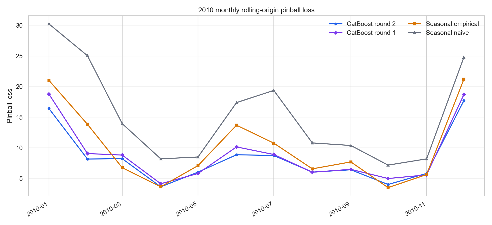
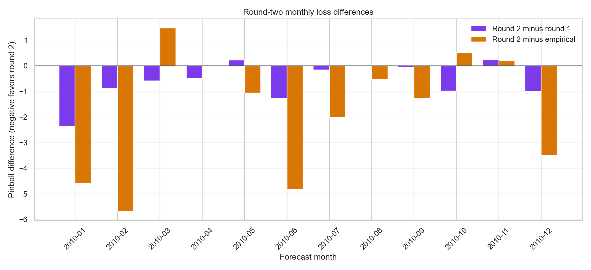
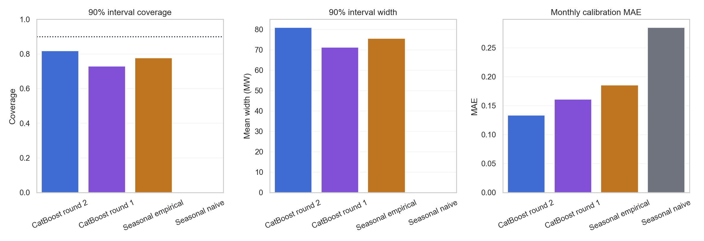
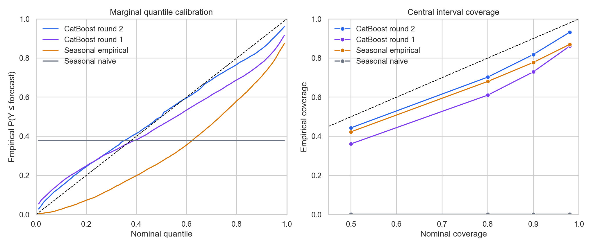
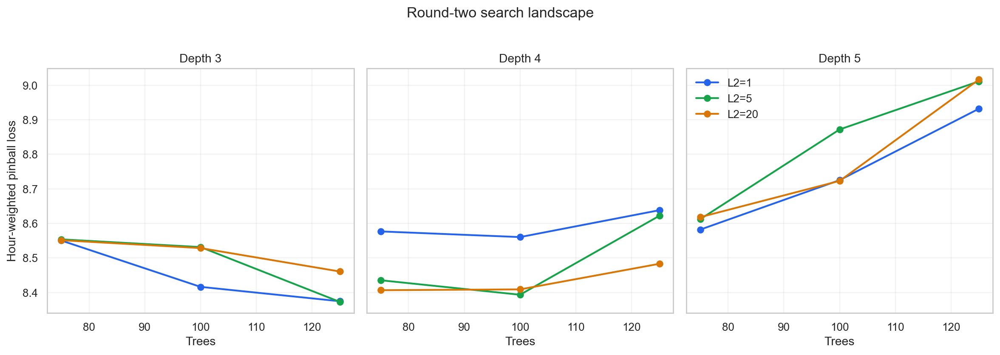

# CatBoost round-2 validation report

## Executive summary

Round two combines a deterministic feature-selection recipe with a compact
CPU CatBoost `MultiQuantile` search. Feature selection reduced the 70-feature
candidate matrix to 17 features, after which all
27 effective hyperparameter candidates were evaluated on the
same 12 monthly rolling-origin validation folds from January through December
2010. The configured 2011 test period was not accessed.

The selected configuration is **depth 3, learning rate
0.08, L2 leaf regularization
5, and 125 trees**. Its
hour-weighted pinball loss is **8.373**, compared with
**8.985** for the selected round-one model and
**10.121** for seasonal empirical. This is a
**6.82%** reduction
relative to round one and a
**17.28%**
reduction relative to the empirical baseline. Round two wins 9 of 12 months
against each and all 12 months against seasonal naive.

The HAC mean-loss tests favor round two over round one (p=
0.0111) and seasonal empirical (p=
0.0141), but the exact sign tests give p=
0.146. Feature selection and model
selection both reused 2010 validation. The improvement is therefore strong
exploratory evidence, not a confirmatory generalization result.

## Validation design and leakage protection

Every 2010 month is treated as a separate forecast origin. Training for a
month uses only pseudo-forecast labels whose forecast month has ended by that
origin. All load- and temperature-derived features are constructed from
observations strictly before the origin; only deterministic target calendar
and horizon information uses the future timestamp. Realized target-month
temperature is never supplied.

The comparison is exactly matched: round two, the selected round-one model,
seasonal empirical, and seasonal naive are all restricted to the same 8,760
hours and 12 origins. Round-one results are taken from its already-saved
candidate `depth4_lr0p04_l25_trees250` rather than retuned on 2010. The 2011 test
period remains untouched.

## Feature selection

### Initial 70-feature candidate set

The initial matrix combined the 45 round-one features with 25 additions. The
additions expanded holiday handling, seasonal load distribution summaries,
recent-level adjustments, annual anchors, temperature-distribution summaries,
and horizon-decayed recent signals. This deliberately broad candidate set was
used only as input to selection; it was not the final model specification.

In the definitions below, the **origin** is midnight immediately before the
forecast month and the **target** is an hour inside that month. “Recent”
windows contain only timestamps strictly before the origin. “Prior-cycle”
seasonal pools also use only pre-origin years and circular month/day distance,
so observations from the target month or a later date can never enter a
feature. Standard deviations are population standard deviations, and
temperature summaries first average the supplied weather stations unless a
station-level aggregation is explicitly stated. Empirical quantiles use
linear interpolation. No realized target-month temperature is used.

| Group | Feature | Definition | Source | Selected |
|---|---|---|---|---|
| Target time | `hour` | Target hour of day, 0–23. | Round 1 | Yes |
| Target time | `day_of_week` | Target weekday, with Monday=0 and Sunday=6. | Round 1 | No |
| Target time | `hour_of_week` | `24 * day_of_week + hour`, giving values 0–167. | Round 1 | No |
| Target time | `month` | Target calendar month, 1–12. | Round 1 | Yes |
| Target time | `is_weekend` | 1 for a Saturday or Sunday target, otherwise 0. | Round 1 | No |
| Target time | `hour_sin` | `sin(2π * hour / 24)`. | Round 1 | No |
| Target time | `hour_cos` | `cos(2π * hour / 24)`. | Round 1 | No |
| Target time | `seasonal_day_sin` | Sine of the target month/day position in a fixed 366-day leap year. | Round 1 | Yes |
| Target time | `seasonal_day_cos` | Cosine of the target month/day position in the same fixed leap year. | Round 1 | No |
| Horizon | `horizon_hours` | Integer hours from the monthly origin to the target; the first hour is 0. | Round 1 | No |
| Horizon | `forecast_week` | Zero-based seven-day horizon bucket: `floor(horizon_hours / 168)`. | Round 1 | No |
| Holiday | `holiday_name` | US federal holiday name for the target day, including observed dates; `none` otherwise. | New in round 2 | No |
| Holiday | `is_holiday` | 1 when the target day is a US federal holiday or its observed date. | New in round 2 | No |
| Holiday | `is_working_day` | 1 for Monday–Friday targets that are not federal holidays. | New in round 2 | No |
| Holiday | `is_day_before_holiday` | 1 when the following calendar day is a federal holiday. | New in round 2 | No |
| Holiday | `is_day_after_holiday` | 1 when the preceding calendar day is a federal holiday. | New in round 2 | No |
| Holiday | `is_year_end_holiday_period` | 1 from December 24–31 or January 1–2. | New in round 2 | No |
| Recent load | `load_mean_7d` | Mean hourly load over the complete 7 days before the origin. | Round 1 | No |
| Recent load | `load_mean_28d` | Mean hourly load over the complete 28 days before the origin. | Round 1 | No |
| Recent load | `load_mean_90d` | Mean hourly load over the complete 90 days before the origin. | New in round 2 | No |
| Recent load | `load_mean_365d` | Mean hourly load over the complete 365 days before the origin. | Round 1 | No |
| Recent load | `load_std_28d` | Population standard deviation of hourly load over the complete 28 days before the origin. | Round 1 | No |
| Recent load | `load_mean_7d_minus_28d` | `load_mean_7d - load_mean_28d`, measuring very-recent level change. | Round 1 | No |
| Recent load | `load_mean_28d_minus_90d` | `load_mean_28d - load_mean_90d`, measuring medium-term level change. | New in round 2 | No |
| Recent load | `load_daily_slope_28d` | OLS slope in MW/day through the 28 pre-origin daily mean loads. | Round 1 | No |
| Recent load | `load_yoy_ratio_28d` | Recent 28-day mean divided by the corresponding 28-day mean one calendar year earlier. | Round 1 | No |
| Recent load | `load_yoy_ratio_365d` | Recent 365-day mean divided by the preceding calendar-aligned 365-day mean. | Round 1 | Yes |
| Recent profile | `load_last_day_same_hour` | Load at the target hour of day in the final complete day before the origin. | Round 1 | No |
| Recent profile | `load_last_same_hour_of_week` | Most recent pre-origin load with the target weekday and hour. | Round 1 | No |
| Recent profile | `load_how_mean_4w` | Mean load for the target hour of week over the final 4 complete weeks. | Round 1 | No |
| Recent profile | `load_how_mean_12w` | Mean load for the target hour of week over the final 12 complete weeks. | Round 1 | No |
| Recent profile | `load_how_std_12w` | Population standard deviation for the target hour of week over the final 12 complete weeks. | Round 1 | No |
| Seasonal load | `load_seasonal_daytype_8d_q10` | 10th percentile of prior-cycle loads matching target hour and weekday/weekend type within ±8 calendar days. | Round 1 | No |
| Seasonal load | `load_seasonal_daytype_8d_q25` | 25th percentile of the same ±8-day day-type analogue pool. | New in round 2 | Yes |
| Seasonal load | `load_seasonal_daytype_8d_q50` | Median of the same ±8-day day-type analogue pool. | Round 1 | No |
| Seasonal load | `load_seasonal_daytype_8d_q75` | 75th percentile of the same ±8-day day-type analogue pool. | New in round 2 | Yes |
| Seasonal load | `load_seasonal_daytype_8d_q90` | 90th percentile of the same ±8-day day-type analogue pool. | Round 1 | Yes |
| Seasonal load | `load_seasonal_daytype_8d_count` | Number of observations in the ±8-day day-type analogue pool. | Round 1 | No |
| Seasonal load | `load_seasonal_how_15d_mean` | Mean prior-cycle load matching exact target weekday and hour within ±15 calendar days. | Round 1 | Yes |
| Seasonal load | `load_seasonal_how_15d_std` | Population standard deviation in the exact-weekday/hour ±15-day analogue pool. | Round 1 | Yes |
| Seasonal load | `load_seasonal_how_15d_count` | Number of observations in the exact-weekday/hour ±15-day analogue pool. | Round 1 | Yes |
| Seasonal load | `load_seasonal_how_30d_mean` | Mean prior-cycle load matching exact target weekday and hour within ±30 calendar days. | New in round 2 | Yes |
| Seasonal load | `load_seasonal_how_30d_std` | Population standard deviation in the exact-weekday/hour ±30-day analogue pool. | New in round 2 | Yes |
| Level adjustment | `load_seasonal_level_ratio_28d` | Observed 28-day mean divided by the mean historical seasonal median estimated for those pre-origin hours. | Round 1 | No |
| Level adjustment | `load_seasonal_daytype_8d_q50_scaled_28d` | Target seasonal median multiplied by `load_seasonal_level_ratio_28d`. | Round 1 | Yes |
| Level adjustment | `load_seasonal_level_delta_28d` | Observed 28-day mean minus the mean historical seasonal median for those pre-origin hours. | New in round 2 | No |
| Level adjustment | `load_seasonal_daytype_8d_q50_shifted_28d` | Target seasonal median plus `load_seasonal_level_delta_28d`. | New in round 2 | No |
| Annual anchor | `load_lag_calendar_1y` | Load at the target timestamp minus one calendar year; preserves month, day, and hour. | Round 1 | No |
| Annual anchor | `load_lag_calendar_2y` | Load at the target timestamp minus two calendar years. | New in round 2 | No |
| Annual anchor | `load_lag_364d` | Load 364 days earlier; preserves weekday and hour because 364 days is 52 weeks. | Round 1 | No |
| Annual anchor | `load_lag_728d` | Load 728 days earlier; preserves weekday and hour across 104 weeks. | New in round 2 | No |
| Annual anchor | `load_annual_anchor_mean` | Mean of the 1-year, 2-year, 364-day, and 728-day load anchors. | New in round 2 | No |
| Annual anchor | `load_annual_anchor_std` | Population standard deviation across the same four annual anchors. | New in round 2 | No |
| Temperature climatology | `temperature_clim_15d_mean` | Mean temperature across stations and prior-cycle target-hour analogues within ±15 calendar days. | Round 1 | No |
| Temperature climatology | `temperature_clim_15d_min_station` | Minimum across station-specific mean temperatures in the ±15-day analogue pool. | Round 1 | No |
| Temperature climatology | `temperature_clim_15d_max_station` | Maximum across station-specific mean temperatures in the ±15-day analogue pool. | Round 1 | No |
| Temperature climatology | `temperature_clim_15d_station_std` | Population standard deviation across station-specific analogue means; a spatial spread measure. | Round 1 | No |
| Temperature climatology | `temperature_clim_15d_temporal_std` | Population standard deviation across analogue-hour station means; a temporal uncertainty measure. | Round 1 | No |
| Temperature climatology | `temperature_clim_15d_q10` | 10th percentile of station-mean temperature across target-hour ±15-day analogues. | New in round 2 | Yes |
| Temperature climatology | `temperature_clim_15d_q90` | 90th percentile of station-mean temperature across target-hour ±15-day analogues. | New in round 2 | Yes |
| Temperature climatology | `temperature_clim_15d_hdd65` | `max(65 - climatological mean temperature, 0)` in the supplied temperature units. | New in round 2 | Yes |
| Temperature climatology | `temperature_clim_15d_cdd65` | `max(climatological mean temperature - 65, 0)` in the supplied temperature units. | New in round 2 | No |
| Recent temperature | `temperature_recent_mean_1d` | Mean observed temperature across stations and hours in the complete day before the origin. | Round 1 | No |
| Recent temperature | `temperature_recent_mean_7d` | Mean observed temperature across stations and hours in the complete 7 days before the origin. | Round 1 | No |
| Recent temperature | `temperature_recent_mean_28d` | Mean observed temperature across stations and hours in the complete 28 days before the origin. | Round 1 | No |
| Recent temperature | `temperature_recent_std_7d` | Population standard deviation over 7 days of hourly temperature after averaging stations. | Round 1 | Yes |
| Recent temperature | `temperature_recent_anomaly_7d` | Observed 7-day mean minus historical seasonal expectations for those same pre-origin hours. | Round 1 | No |
| Horizon decay | `temperature_recent_anomaly_7d_decay_14d` | `temperature_recent_anomaly_7d * exp(-horizon_hours / (24 * 14))`. | New in round 2 | No |
| Horizon decay | `load_last_day_same_hour_decay_2d` | `load_last_day_same_hour * exp(-horizon_hours / (24 * 2))`. | New in round 2 | No |
| Horizon decay | `load_last_same_hour_of_week_decay_7d` | `load_last_same_hour_of_week * exp(-horizon_hours / (24 * 7))`. | New in round 2 | No |

The machine-readable version of this table is saved as
`candidate_feature_dictionary.csv`.

### Six-month importance screening

The screening folds were January, March, May, July, September, and November
2010. Alternating months provide observations across the complete annual
cycle while reserving a disjoint, seasonally complementary set of six months
for verification. Using six rather than all twelve months approximately
halved the expensive importance stage and still allowed the rule to require
repeated evidence across several origins. Six is therefore a pragmatic
compute/evidence trade-off, not a claim that six months are statistically
optimal.

For every screening origin, a fixed fast CatBoost model (depth 4, learning
rate 0.08, L2=5, 125 trees) was fitted with all 70 candidates. The training
set and feature construction followed the same rolling-origin restrictions as
the final evaluation. CatBoost `LossFunctionChange` was then calculated on
that month's validation observations. Positive values mean that removing or
perturbing the feature increases validation loss for that fitted model; they
are model-conditional importance estimates, not causal effects.

Importance was aggregated by feature across the six months. The predeclared
mechanical rule retained a feature when:

1. its median `LossFunctionChange` was strictly positive; and
2. it had positive importance in at least four of the six folds.

Candidates passing both conditions were ranked by median importance and were
subject to a maximum of 55 features. The cap was not reached: exactly
17 features passed. The four-of-six requirement favors
features with reasonably repeatable value while allowing two months with a
zero or negative estimate. It can miss effects that are useful only in a
narrow season; that is an intentional limitation of this compact selection
procedure. The complete screening and verification pipeline took
3.4 minutes on the
development machine.

### Verification on the complementary six months

After screening, the 17-feature set was frozen. It was
then evaluated on February, April, June, August, October, and December 2010
using the same fixed fast CatBoost configuration. To isolate the value of the
feature set, it was compared with the matching 45-feature round-one model at
the same depth, learning rate, regularization, and tree count rather than with
either round's fully tuned winner. The acceptance guard allowed no more than
a 0.5% average degradation relative to this round-one reference.

The selected set achieved pinball loss
8.559, versus
8.922 for
the matched round-one model: a
4.08%
reduction, with wins in
4 of 6 months. It
therefore passed the guard and was carried into the 12-fold hyperparameter
search. This complementary check reduces the risk of selecting features that
only look useful in the six screening months. It is not an independent final
validation result, because all twelve 2010 months were subsequently reused in
the round-two grid search; the untouched 2011 period remains the test.

### Final 17-feature set

“Median importance” and “positive folds” below refer only to the six screening
months. Rank is descending median `LossFunctionChange`; it is not a claim that
features act independently.

| Rank | Feature | Definition | Source | Positive folds | Median importance |
|---|---|---|---|---|---|
| 1 | `load_seasonal_how_30d_mean` | Mean prior-cycle load matching exact target weekday and hour within ±30 calendar days. | New in round 2 | 6/6 | 1.1483 |
| 2 | `load_seasonal_how_15d_mean` | Mean prior-cycle load matching exact target weekday and hour within ±15 calendar days. | Round 1 | 6/6 | 0.5117 |
| 3 | `month` | Target calendar month, 1–12. | Round 1 | 4/6 | 0.4277 |
| 4 | `load_seasonal_daytype_8d_q90` | 90th percentile of the same ±8-day day-type analogue pool. | Round 1 | 4/6 | 0.2171 |
| 5 | `load_seasonal_how_15d_count` | Number of observations in the exact-weekday/hour ±15-day analogue pool. | Round 1 | 4/6 | 0.1836 |
| 6 | `load_seasonal_daytype_8d_q75` | 75th percentile of the same ±8-day day-type analogue pool. | New in round 2 | 4/6 | 0.0978 |
| 7 | `load_yoy_ratio_365d` | Recent 365-day mean divided by the preceding calendar-aligned 365-day mean. | Round 1 | 4/6 | 0.0895 |
| 8 | `seasonal_day_sin` | Sine of the target month/day position in a fixed 366-day leap year. | Round 1 | 4/6 | 0.0848 |
| 9 | `temperature_clim_15d_q10` | 10th percentile of station-mean temperature across target-hour ±15-day analogues. | New in round 2 | 4/6 | 0.0743 |
| 10 | `temperature_recent_std_7d` | Population standard deviation over 7 days of hourly temperature after averaging stations. | Round 1 | 4/6 | 0.0327 |
| 11 | `load_seasonal_daytype_8d_q25` | 25th percentile of the same ±8-day day-type analogue pool. | New in round 2 | 4/6 | 0.0287 |
| 12 | `load_seasonal_daytype_8d_q50_scaled_28d` | Target seasonal median multiplied by `load_seasonal_level_ratio_28d`. | Round 1 | 4/6 | 0.0254 |
| 13 | `load_seasonal_how_15d_std` | Population standard deviation in the exact-weekday/hour ±15-day analogue pool. | Round 1 | 5/6 | 0.0117 |
| 14 | `temperature_clim_15d_hdd65` | `max(65 - climatological mean temperature, 0)` in the supplied temperature units. | New in round 2 | 4/6 | 0.0096 |
| 15 | `load_seasonal_how_30d_std` | Population standard deviation in the exact-weekday/hour ±30-day analogue pool. | New in round 2 | 4/6 | 0.0085 |
| 16 | `temperature_clim_15d_q90` | 90th percentile of station-mean temperature across target-hour ±15-day analogues. | New in round 2 | 4/6 | 0.0062 |
| 17 | `hour` | Target hour of day, 0–23. | Round 1 | 4/6 | 0.0040 |

Seven selected features were new relative to round one: `load_seasonal_how_30d_mean`, `load_seasonal_daytype_8d_q75`, `temperature_clim_15d_q10`, `load_seasonal_daytype_8d_q25`, `temperature_clim_15d_hdd65`, `load_seasonal_how_30d_std`, `temperature_clim_15d_q90`.
The final set is dominated by historical seasonal-profile level, spread, and
support, augmented by annual load growth, two calendar variables, and both
climatological and recent temperature information. `hour` and `month` are
passed to CatBoost as categorical variables. The compact result also shows
why importance screening was useful: 53 candidates, including several
intuitively plausible recent-load and annual-lag signals, did not satisfy the
same cross-month rule.

## Primary matched validation comparison

Pinball loss averages all 99 quantiles and all 2010 forecast hours; lower is
better. Monthly mean and standard deviation weight each origin equally.
Median bias is `actual - q0.50`, so a positive value denotes under-forecasting.

| Model | Pinball | Improvement vs empirical (%) | Monthly mean | Monthly SD | Median MAE | Median bias |
|---|---|---|---|---|---|---|
| CatBoost round 2 | 8.373 | +17.28 | 8.348 | 4.420 | 23.00 | +4.36 |
| CatBoost round 1 | 8.985 | +11.22 | 8.960 | 4.935 | 24.46 | +8.75 |
| Seasonal empirical | 10.121 | +0.00 | 10.125 | 6.131 | 27.98 | +20.83 |
| Seasonal naive | 15.310 | -51.27 | 15.343 | 7.909 | 30.62 | +12.02 |

Round two reduces median MAE by
1.46 MW relative to round one and
cuts median under-forecast bias from +8.75
to +4.36 MW. Relative to seasonal
empirical, pinball improves by
17.28% and
median MAE improves by 4.99 MW.



## Stability across months and quarters

| Quarter | Round 2 | Round 1 | Empirical | Improvement vs round 1 (%) | Wins vs round 1 |
|---|---|---|---|---|---|
| Q1 | 11.037 | 12.330 | 13.878 | +10.49 | 3/3 |
| Q2 | 6.184 | 6.695 | 8.138 | +7.63 | 2/3 |
| Q3 | 7.081 | 7.154 | 8.359 | +1.02 | 2/3 |
| Q4 | 9.223 | 9.811 | 10.170 | +5.99 | 2/3 |

Round two improves on round one in every quarter, with the largest aggregate
gain in Q1. Its largest monthly improvement against round one is
January (-2.357
loss points); its largest deterioration is
November (+0.247).
The three losses against round one occur in May, August, and November; two are
small. Against seasonal empirical, the losses occur in March, October, and
November. This is meaningful variability despite the strong annual aggregate.



## Paired statistical comparison

| Reference | Mean difference | Wins | Losses | HAC p | Sign p | HAC 95% CI |
|---|---|---|---|---|---|---|
| CatBoost round 1 | -0.613 | 9 | 3 | 0.01112 | 0.146 | [-1.055, -0.170] |
| Seasonal empirical | -1.777 | 9 | 3 | 0.01412 | 0.146 | [-3.120, -0.434] |
| Seasonal naive | -6.995 | 12 | 0 | 0.0008123 | 0.0004883 | [-10.369, -3.621] |

The paired unit is a monthly forecast origin rather than an individual hour.
The Diebold–Mariano-style mean-loss test uses a Bartlett HAC variance with lag
2 and a t(11) small-sample reference. It uses the magnitude of monthly
gains and allows short-range serial dependence. The exact two-sided sign test
uses only the 12 win/loss outcomes; with 9 wins and 3 losses its p-value is
0.146, illustrating the low power of a 12-fold comparison.

The HAC intervals exclude zero for round two versus round one and empirical.
However, the same validation year informed the earlier feature search,
inspection of round-one results, feature verification, and final model
selection. Consequently, these validation p-values are descriptive and should
not be presented as confirmatory.

Against seasonal naive the result is much less ambiguous: round two improves
pinball by 45.31%,
wins every month, and has HAC p=0.0008123.

## Calibration, sharpness, and quantile coherence

Calibration MAE is calculated within each month over all 99 marginal
quantiles, then averaged with forecast-hour weights.

| Model | Calibration MAE | 90% coverage | 90% width | Invalid intervals | Crossings | Crossing rate (%) |
|---|---|---|---|---|---|---|
| CatBoost round 2 | 0.134 | 0.818 | 80.96 | 0 | 2849 | 0.332 |
| CatBoost round 1 | 0.161 | 0.729 | 71.27 | 0 | 1236 | 0.144 |
| Seasonal empirical | 0.185 | 0.778 | 75.59 | 0 | 0 | 0.000 |
| Seasonal naive | 0.285 | 0.002 | 0.00 | 0 | 0 | 0.000 |

Round two materially improves calibration relative to round one: monthly
calibration MAE falls from
0.161 to
0.134, while nominal 90% coverage rises
from 72.9% to
81.8%. Coverage remains below the nominal 90%
target. Round two's intervals are wider than both round one and empirical, so
part of the calibration gain comes from reduced sharpness rather than location
accuracy alone.

No model has a reversed 5th/95th percentile interval. Round two has
2,849 adjacent crossings, a
0.332% rate. This is higher than round
one but still affects fewer than one half of one percent of adjacent quantile
pairs. Scores use raw output; monotonic rearrangement has not been applied.



### Full marginal and interval calibration curves

The aggregate marginal curve evaluates `P(Y ≤ qτ)` at every requested
quantile τ. Round two's predicted median has empirical marginal coverage
50.0%; the complete curve makes remaining
lower- and upper-tail asymmetry visible rather than reducing calibration to one
average. The central-interval panel separately compares empirical coverage at
the configured 50%, 80%, 90%, and 98% levels. Both panels use exactly the same
2010 observations for round two, round one, and the baselines.



Exact curve values and interval widths are in `quantile_calibration.csv` and
`interval_calibration.csv`.

## What the search learned

The search jointly varied depth {3, 4, 5}, L2 regularization {1, 5, 20},
and tree checkpoints {75, 100, 125} at learning rate 0.08. Every effective
candidate used all 12 folds. Tree prefixes shared parent fits, so 27 candidates
required 108 actual fold fits and 19.7 minutes of summed
model-fit time.

Best checkpoint for each depth/L2 pair:

| Depth | L2 | Best trees | Pinball | 90% coverage | Crossings |
|---|---|---|---|---|---|
| 3 | 1 | 125 | 8.375 | 0.819 | 2453 |
| 3 | 5 | 125 | 8.373 | 0.818 | 2849 |
| 3 | 20 | 125 | 8.461 | 0.814 | 2061 |
| 4 | 1 | 100 | 8.560 | 0.787 | 2304 |
| 4 | 5 | 100 | 8.393 | 0.799 | 1945 |
| 4 | 20 | 75 | 8.407 | 0.831 | 1225 |
| 5 | 1 | 75 | 8.582 | 0.784 | 2367 |
| 5 | 5 | 75 | 8.612 | 0.788 | 878 |
| 5 | 20 | 75 | 8.618 | 0.786 | 758 |

The top candidates are:

| Candidate | Pinball | 90% coverage | Calibration MAE | Crossings |
|---|---|---|---|---|
| depth3_lr0p08_l25_trees125 | 8.3727 | 0.818 | 0.134 | 2849 |
| depth3_lr0p08_l21_trees125 | 8.3746 | 0.819 | 0.135 | 2453 |
| depth4_lr0p08_l25_trees100 | 8.3934 | 0.799 | 0.125 | 1945 |
| depth4_lr0p08_l220_trees75 | 8.4065 | 0.831 | 0.124 | 1225 |
| depth4_lr0p08_l220_trees100 | 8.4089 | 0.811 | 0.130 | 2325 |
| depth3_lr0p08_l21_trees100 | 8.4162 | 0.829 | 0.130 | 1158 |
| depth4_lr0p08_l25_trees75 | 8.4353 | 0.823 | 0.125 | 706 |
| depth3_lr0p08_l220_trees125 | 8.4607 | 0.814 | 0.139 | 2061 |

Depth 3 is preferred: its L2=1 and L2=5 results at 125 trees are nearly tied,
differing by only
0.022%.
This indicates that the leading result is not highly sensitive to modest L2
changes. Depth 4 remains competitive around 75–100 trees, while depth 5 is
worse and deteriorates as trees are added. The deeper models also narrow
intervals and create more crossings, consistent with quantile overfitting.



## Limitations and next decision

- Feature selection, feature-set verification, and hyperparameter selection
  all used 2010. The final 8.373 validation score is therefore optimistic.
- Only 12 monthly folds are available, so paired inference has low power and
  is sensitive to a few large winter-month differences.
- Round two searched one learning rate. The planned lower-rate refinement
  around the winning shallow structure has not yet been run.
- Forecasts use temperature climatology and observed pre-origin weather, not
  realized future temperature. Unexpected target-month weather remains an
  irreducible source of error under this assumption.
- Search artifacts contain fold diagnostics rather than every CatBoost
  quantile prediction. A final evaluation runner should save all 99 quantiles
  and explicitly evaluate monotonic rearrangement if it is adopted.

The leading structure is stable enough to justify a small learning-rate/tree
refinement rather than another broad grid. After that choice is frozen, the
2011 rolling-origin test should be run exactly once. Test performance—not the
adaptive 2010 p-values—must be the main evidence of generalization.

## Reproduction and artifacts

From the repository root:

```bash
.venv/bin/python analysis/catboost/search.py --config configs/catboost_round2_phase1.yaml
.venv/bin/python -m analysis.catboost.predict_selected
.venv/bin/python -m analysis.catboost.round2_report
```

The search is resumable. Raw outputs are in
[`../search/round2_phase1`](../search/round2_phase1), the feature-selection
artifacts are in [`../feature_selection/round2`](../feature_selection/round2),
and the selected feature manifest is
[`selected_features.yaml`](../feature_selection/round2/selected_features.yaml).
Supporting outputs in this directory are `model_comparison.csv`,
`fold_comparison.csv`, `quarter_comparison.csv`, `paired_tests.csv`,
`candidate_shortlist.csv`, `structure_summary.csv`,
`candidate_feature_dictionary.csv`, and `selected_feature_summary.csv`.
