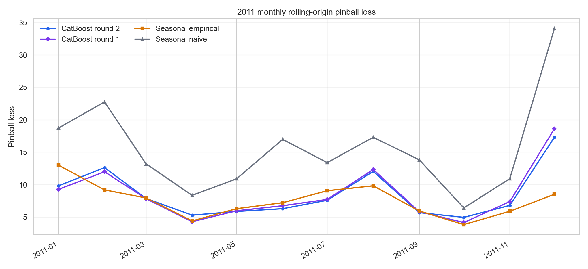
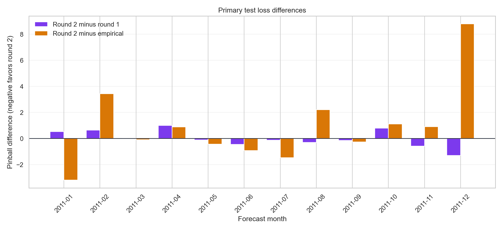
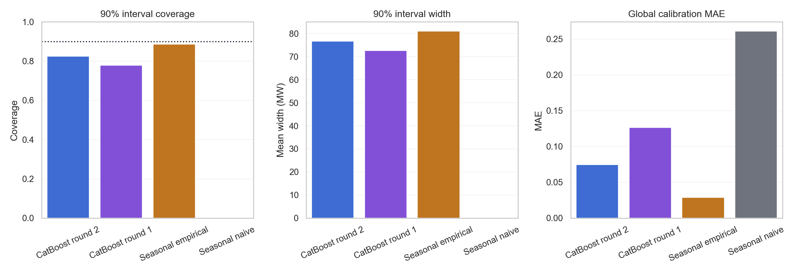
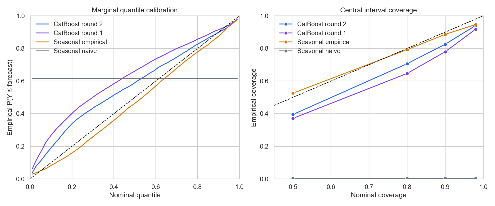

# Locked 2011 rolling-origin test report

## Executive summary

This report is the first and only evaluation on the configured 2011 test
period. The specifications of all four methods were frozen before test access:
seasonal naive, seasonal empirical, the selected round-one CatBoost, and the
selected round-two CatBoost. Round two was declared the primary final model;
round one was retained as a pre-specified comparator rather than selected
after viewing test results.

The primary round-two model obtains hour-weighted pinball loss
**8.517**, compared with
**7.613** for seasonal empirical,
**8.522** for round one, and
**15.555** for seasonal naive. Round two is
**11.87% worse**
than the primary empirical reference and
**0.07% better**
than round one.

Against seasonal empirical, round two wins 6 of 12
months; the HAC mean-loss p-value is 0.2786 and
the exact sign-test p-value is 1.
Against round one it wins 7 months, with HAC p=
0.9965. These test estimates were computed
only after model and hyperparameter selection was completed on validation.
The report nevertheless emphasizes effect sizes and monthly stability because
only 12 test folds are available.

## Locked evaluation protocol

Each 2011 month is forecast as a separate rolling origin. January is trained
using pseudo-origin labels available through December 2010. After January's
predictions are saved, January outcomes become eligible for the February fit,
and so on through December. Training therefore grows from 35,064 labeled
pseudo-forecast rows in January to 43,080 in December.

This is a production-style sequence of twelve one-month-ahead forecasts, not
one forecast made in January for the entire year. The forecasting procedure is
frozen, while CatBoost is refitted at each origin using only information then
available. Thus a revealed test month may train a later-origin model, but can
never affect its own forecast or an earlier forecast.

For every origin, all load and temperature features use observations strictly
before that origin. Realized target-month temperature is never supplied. The
round-one model uses its frozen 45 features with depth 4, learning rate 0.04,
L2=5, and 250 trees. Round two uses its frozen 17 selected features with depth
3, learning rate 0.08, L2=5, and 125 trees. Baseline definitions are unchanged.
No test score was used for feature selection, hyperparameter selection,
calibration correction, ensembling, or any other tuning decision. Earlier
2011 observations enter later fits only through the predeclared rolling-update
rule described above.

## Primary metrics

Pinball loss averages all 99 quantiles and all 8,760 test hours. Monthly mean
and standard deviation weight each origin equally. Median bias is
`actual - q0.50`, so positive values denote under-forecasting.

| Model | Pinball | Improvement vs empirical (%) | Monthly mean | Monthly SD | Median MAE | Median bias |
|---|---|---|---|---|---|---|
| CatBoost round 2 | 8.517 | -11.87 | 8.523 | 3.760 | 23.59 | -7.43 |
| CatBoost round 1 | 8.522 | -11.94 | 8.524 | 4.102 | 23.41 | -10.61 |
| Seasonal empirical | 7.613 | +0.00 | 7.607 | 2.550 | 21.11 | +4.62 |
| Seasonal naive | 15.555 | -104.33 | 15.581 | 7.391 | 31.11 | -13.44 |

On the realized 2011 sample, seasonal empirical has the lowest aggregate loss
and median MAE. The two CatBoost models are practically tied: round two lowers
annual loss by only 0.07%.
The primary statistical comparison does not establish a difference between
round two and empirical at conventional significance levels, so the result is
best described as a test-set reversal in observed ranking rather than evidence
that one method is uniformly superior.



## Monthly and seasonal stability

| Quarter | Round 2 | Round 1 | Empirical | Naive | R2 vs empirical (%) |
|---|---|---|---|---|---|
| Q1 | 10.029 | 9.634 | 10.087 | 18.087 | +0.58 |
| Q2 | 5.831 | 5.686 | 5.989 | 12.078 | +2.64 |
| Q3 | 8.479 | 8.668 | 8.313 | 14.863 | -2.00 |
| Q4 | 9.731 | 10.094 | 6.099 | 17.211 | -59.56 |

Round two's largest monthly gain against empirical is
-3.189 pinball points in
January; its largest loss is
+8.793 in
December. Against round one, the
range is -1.303 to
+1.003. This fold-level variation is essential
context for the annual aggregate.



## Paired statistical comparisons

| Role | Model | Reference | Mean diff | Wins | Losses | HAC p | Sign p | HAC 95% CI |
|---|---|---|---|---|---|---|---|---|
| primary | CatBoost round 2 | Seasonal empirical | +0.916 | 6 | 6 | 0.2786 | 1 | [-0.853, 2.685] |
| secondary | CatBoost round 2 | CatBoost round 1 | -0.001 | 7 | 5 | 0.9965 | 0.7744 | [-0.413, 0.412] |
| secondary | CatBoost round 2 | Seasonal naive | -7.058 | 12 | 0 | 8.034e-06 | 0.0004883 | [-9.043, -5.073] |
| secondary | CatBoost round 1 | Seasonal empirical | +0.917 | 7 | 5 | 0.3389 | 0.7744 | [-1.102, 2.935] |
| secondary | CatBoost round 1 | Seasonal naive | -7.057 | 12 | 0 | 4.049e-06 | 0.0004883 | [-8.904, -5.210] |
| secondary | Seasonal empirical | Seasonal naive | -7.974 | 12 | 0 | 0.000194 | 0.0004883 | [-11.181, -4.767] |

The paired unit is one monthly origin. Each Diebold–Mariano-style mean-loss
test uses a Bartlett HAC variance with lag 2 and a t(11) small-sample
reference. The exact two-sided sign test discards magnitude and uses only
monthly win/loss direction. The round-two versus empirical comparison was
predeclared as primary and is interpreted separately. Model selection was
completed without 2011; the other displayed comparisons are secondary.

## Marginal calibration, intervals, and quantile coherence

Global marginal calibration MAE averages `|P(Y ≤ qτ) - τ|` across all 99
quantiles. The predicted-median empirical coverages are
58.9% for round two,
66.1% for round one,
46.3% for empirical, and
61.6% for naive.

| Model | Calibration MAE | Max calibration error | Crossings | Crossing rate (%) |
|---|---|---|---|---|
| CatBoost round 2 | 0.075 | 0.142 | 9640 | 1.123 |
| CatBoost round 1 | 0.127 | 0.207 | 676 | 0.079 |
| Seasonal empirical | 0.029 | 0.045 | 0 | 0.000 |
| Seasonal naive | 0.261 | 0.606 | 0 | 0.000 |

Central interval coverage and sharpness:

| Model | Nominal | Coverage | Error | Mean width |
|---|---|---|---|---|
| CatBoost round 2 | 50% | 39.5% | -10.5 pp | 30.37 |
| CatBoost round 2 | 80% | 70.6% | -9.4 pp | 59.50 |
| CatBoost round 2 | 90% | 82.5% | -7.5 pp | 76.72 |
| CatBoost round 2 | 98% | 94.0% | -4.0 pp | 109.13 |
| CatBoost round 1 | 50% | 37.1% | -12.9 pp | 29.79 |
| CatBoost round 1 | 80% | 64.7% | -15.3 pp | 56.86 |
| CatBoost round 1 | 90% | 78.0% | -12.0 pp | 72.63 |
| CatBoost round 1 | 98% | 91.7% | -6.3 pp | 100.29 |
| Seasonal empirical | 50% | 52.6% | +2.6 pp | 35.36 |
| Seasonal empirical | 80% | 79.3% | -0.7 pp | 65.27 |
| Seasonal empirical | 90% | 88.6% | -1.4 pp | 81.01 |
| Seasonal empirical | 98% | 94.6% | -3.4 pp | 102.03 |
| Seasonal naive | 50% | 0.3% | -49.7 pp | 0.00 |
| Seasonal naive | 80% | 0.3% | -79.7 pp | 0.00 |
| Seasonal naive | 90% | 0.3% | -89.7 pp | 0.00 |
| Seasonal naive | 98% | 0.3% | -97.7 pp | 0.00 |

Seasonal empirical is also the strongest calibrated probabilistic forecast on
this test year: its 90% interval covers 88.6%
of outcomes and its global calibration MAE is
0.029. Round two improves materially on
round one's calibration and interval coverage, but remains under-dispersed.
That calibration gain comes with more raw adjacent quantile crossings
(1.123% versus
0.079%); crossings are reported rather than
silently repaired. Seasonal naive repeats one point across all quantiles, so
its interval width is zero and its probabilistic calibration is correspondingly
poor.



The full marginal curve shows calibration at every requested quantile; the
central-interval panel shows the configured 50%, 80%, 90%, and 98% levels.
All curves use the same 8,760 test outcomes.



Exact values are in `quantile_calibration.csv` and
`interval_calibration.csv`. Scores and calibration use raw model output; no
monotonic rearrangement is applied.

## Validation-to-test comparison

| Model | 2010 validation | 2011 test | Test change (%) |
|---|---|---|---|
| CatBoost round 2 | 8.373 | 8.517 | +1.72 |
| CatBoost round 1 | 8.985 | 8.522 | -5.16 |
| Seasonal empirical | 10.121 | 7.613 | -24.78 |
| Seasonal naive | 15.310 | 15.555 | +1.60 |

This table is diagnostic, not a new selection step. The 2010 column is the
matched validation period used in the round-two report; the 2011 column is the
locked test. Changes may reflect realized weather, load drift, and finite-fold
variation as well as generalization error.

## Limitations

- The test contains only 12 monthly origins, so confidence intervals and
  p-values remain sensitive to individual seasons.
- Historical and pre-origin temperature features cannot anticipate unusual
  target-month weather.


## Reproduction and artifacts

From the repository root:

```bash
.venv/bin/python -m analysis.model_data.run --feature-config configs/features/round2_candidates.yaml --split test
.venv/bin/python -m analysis.baseline.run --split test
.venv/bin/python -m analysis.catboost.predict_selected --experiment round1_test --experiment round2_test
.venv/bin/python -m analysis.catboost.test_report
```

The CatBoost prediction runner is resumable by monthly origin. Complete
per-hour forecasts are under `artifacts/catboost/predictions/test/`; baseline
forecasts are under `artifacts/baseline/test/`. Supporting tables in this
directory are `model_comparison.csv`, `fold_comparison.csv`,
`quarter_comparison.csv`, `paired_tests.csv`, `quantile_calibration.csv`,
`interval_calibration.csv`, and `validation_to_test.csv`.
