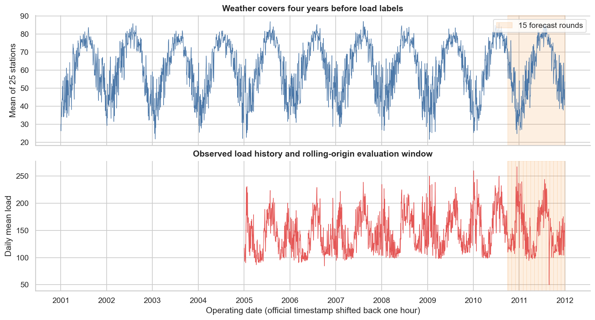
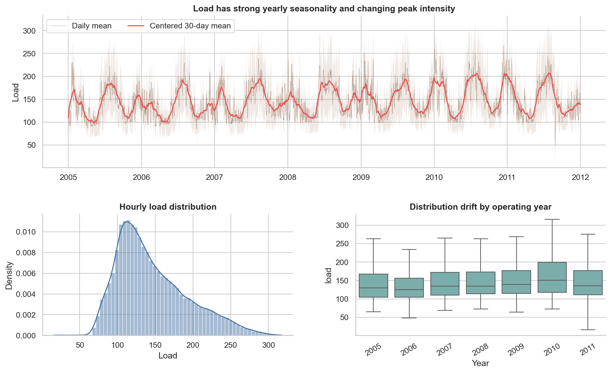
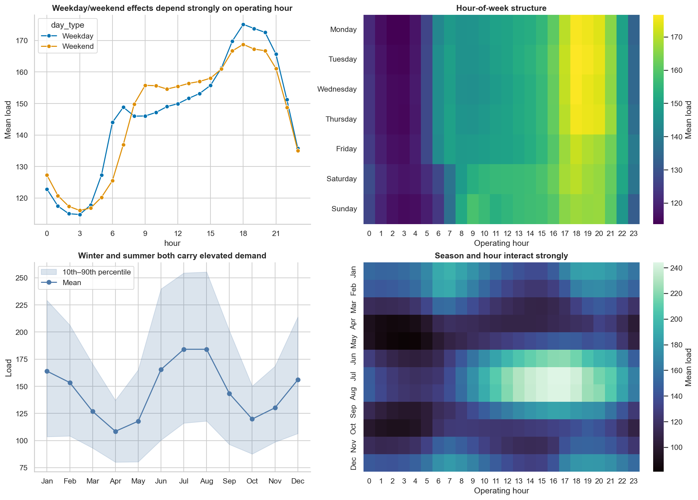
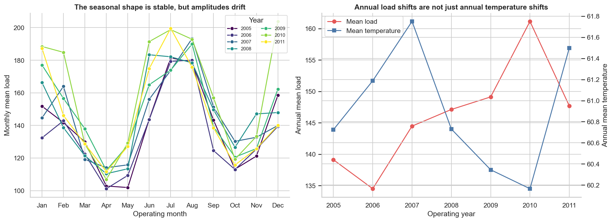
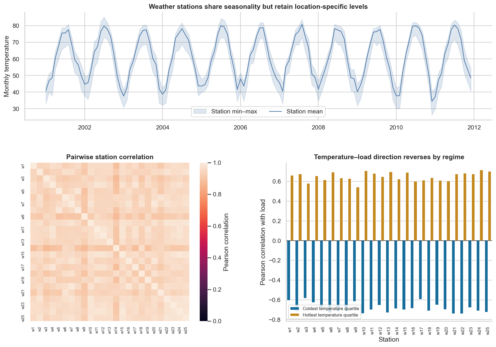
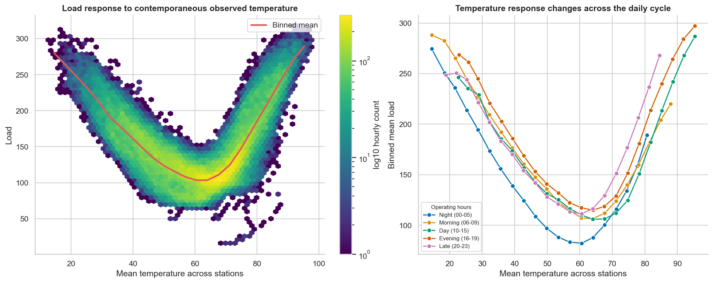

# GEFCom2014 load-track exploratory data analysis

## Executive summary

The supplied load track is clean at the structural level but has several modeling traps. It contains one zone, 25 temperature-station series, 96,408 consecutive hourly weather rows from 2001 through 2011, and 61,344 observed load rows from 2005 through 2011. The 35,064 early missing loads form one intentional four-year weather-only block; there are no missing weather values, duplicate timestamps, hourly gaps, nonpositive observed loads.

The dominant signals are calendar seasonality, serial dependence, and a strongly nonlinear temperature response. Load is U-shaped against contemporaneous mean temperature, with minimum binned demand around 59–62 in the source temperature units. The linear correlation over all temperatures is consequently only 0.103, while it is -0.775 in the coldest quartile and +0.778 in the hottest quartile. A single linear temperature coefficient would conceal most of this relationship.

Extreme load observations are retained because there is insufficient evidence that they are measurement errors, and sustained unusual values may represent genuine system events. Removing them would suppress important tail behavior, make the predicted distribution too narrow, and impair the 1st and 99th quantile forecasts. They are therefore flagged for transparent inspection and sensitivity analysis rather than silently altered or discarded.

## Scope and reproducibility

This analysis uses all sequential `Task 1`–`Task 15` train releases and the released Task 15 load/temperature solution for retrospective EDA. It does **not** treat later-released observations as if they had been available at earlier forecast origins. The distinction matters: complete-history loading is for description only, while the tested training loader reads at most the release available at a requested origin.

Run the analysis from the repository root:

```bash
.venv/bin/python -m analysis.eda.run --config configs/eda.yaml
```

**Code and data.** End-to-end execution starts in [`main()`](analysis/eda/run.py#L15), reads [`configs/eda.yaml`](configs/eda.yaml), and calls [`analyze()`](analysis/eda/analysis.py#L56). Reusable release-aware loading is in [`data.py`](src/gefcom2014/data.py), while generated numerical results are written under [`artifacts/eda/tables/`](artifacts/eda/tables/).

## Dataset structure, timestamp conventions, and data quality

The raw files are sequential releases:

- Task 1 contains the long history through the first forecast origin.
- Each Task 2–15 train file contains the newly revealed actual load and temperature for the preceding target month.
- Each benchmark file defines that task's next monthly horizon and 99 quantile columns.
- The separate Task 15 solution supplies December 2011 actuals and weather.

The compact `MMDDYYYY H:MM` date strings have unpadded month and day fields. Some strings are ambiguous in isolation, so the loader enumerates valid calendar interpretations and resolves them using exact hourly continuity. This behavior is tested because a conventional vectorized parser silently creates duplicated and misordered dates.

The timestamps are hour-ending labels. The last Task 15 temperature value is explicitly day 31, hour 24, while the corresponding load solution calls the same observation 1 January at `00:00`. Calendar features and operating dates therefore use `timestamp - 1 hour`. After that conversion, all 4,017 operating days have exactly 24 observations. No timezone is supplied, and the fixed 24-hour days suggest a standardized or preprocessed clock rather than a timezone-aware local series.

The following coverage and data-quality checks include missing values, duplicate timestamps, hourly gaps, and operating-day row counts. All 35,064 missing load values belong to the single early weather-only block; missing loads are not scattered through the observed-load period. Weather is complete throughout.

| Property | Finding |
|---|---:|
| Weather coverage | 2001-01-01 00:00 to 2011-12-31 23:00 (operating intervals) |
| Load coverage | 2005-01-01 00:00 to 2011-12-31 23:00 |
| Total / observed-load hours | 96,408 / 61,344 |
| Early weather-only hours | 35,064 in one contiguous block |
| Zones / weather stations | 1 / 25 |
| Missing weather / duplicate timestamps / non-hourly steps | 0 / 0 / 0 |
| Operating days not containing 24 rows | 0 |
| Forecast rounds / target hours | 15 / 10,968 |



**Code and data.** Raw releases are read by [`load_complete_history()`](src/gefcom2014/data.py#L265), timestamp and calendar fields are added by `prepare_history()`, and integrity/missingness checks are calculated by `analyze_load()` in [`analysis.py`](analysis/eda/analysis.py). Minimal forecast-window metadata is produced by `describe_forecast_periods()` in the same file and written to [`round_manifest.csv`](artifacts/eda/tables/round_manifest.csv). [`plot_data_coverage()`](analysis/eda/load_plots.py#L18) generates [`01_data_coverage.png`](artifacts/eda/figures/01_data_coverage.png).

## Load distribution, trends, and extremes

Hourly load has mean 146.18, standard deviation 46.98, median 135.1, and positive skew 0.817. The central 90% spans 85.9–239.8; the full range is 16.1–317.5. There are no zero or negative values. Annual means are not stationary: they range from 134.52 in 2006 to 161.15 in 2010, a difference of 19.8%. Annual mean temperature does not move in parallel with this load trend, so weather alone cannot explain the drift.

For transparent extreme-value diagnostics, observations at or below the empirical 0.1% quantile (66.7) or at or above the 99.9% quantile (299.8) are written to [`extreme_load_hours.csv`](artifacts/eda/tables/extreme_load_hours.csv). These thresholds flag distribution tails; they do not by themselves prove measurement error. The largest values are coherent clusters of hot summer afternoons. The maximum, 317.5, occurs during the operating hour beginning 16:00 on 22 July 2011, when the station-average temperature is 92.32. The lower tail is qualitatively different. Twenty-four consecutive operating hours across 27–28 August 2011 are below 50, with values as low as 16.1. Only three other sub-50 observations occur together on 3 October 2006, plus two on 29 August 2011. This is a discrete event-like pattern rather than an ordinary continuation of the distribution.

Most flagged values occur across several consecutive hours rather than as isolated spikes, making real system events more plausible than single corrupted readings. They are therefore retained in the training data. Removing extreme loads would make the predicted distribution too narrow and damage the 1st/99th quantiles.



The top absolute one-hour change is +52.2; large changes otherwise concentrate around morning/evening ramps and the event-like periods.

**Code and data.** [`analyze_load()`](analysis/eda/analysis.py#L167) calculates the values in [`load_distribution.csv`](artifacts/eda/tables/load_distribution.csv), [`yearly_summary.csv`](artifacts/eda/tables/yearly_summary.csv), [`extreme_load_hours.csv`](artifacts/eda/tables/extreme_load_hours.csv), and [`largest_hourly_load_changes.csv`](artifacts/eda/tables/largest_hourly_load_changes.csv). [`plot_load_overview()`](analysis/eda/load_plots.py#L54) generates [`02_load_overview.png`](artifacts/eda/figures/02_load_overview.png).

## Calendar seasonality

Calendar effects are strong and interactive:

- Mean hourly load is lowest at operating hour 03:00 (115.14) and highest at 18:00 (173.31).
- Weekday and weekend **overall** means are almost identical (146.33 and 145.79), but that aggregate hides a marked interaction: weekends rise later in the morning, while weekdays have sharper early-morning and evening ramps.
- Monthly means show two high-demand seasons: July/August are about 184.1, while January reaches 164.0. Lower-demand periods occur in spring and autumn: April is the global trough at 108.5, and October is a secondary trough at 119.8.
- The hour-of-day shape changes by season. Summer has a broad afternoon peak, whereas winter shows pronounced morning and evening demand.



The seasonal shape recurs each year, but its amplitude and level shift materially. This argues against a random split and explains why one held-out month cannot represent general performance.



**Code and data.** Calendar fields are created by [`prepare_history()`](analysis/eda/analysis.py#L94). [`plot_calendar_seasonality()`](analysis/eda/load_plots.py#L102) calculates the hour/day/month aggregations and generates [`03_calendar_seasonality.png`](artifacts/eda/figures/03_calendar_seasonality.png); [`plot_year_month_drift()`](analysis/eda/load_plots.py#L149) calculates the year/month aggregates and generates [`09_year_month_drift.png`](artifacts/eda/figures/09_year_month_drift.png).

## Weather-station structure and load response

All 25 weather columns are complete integer-valued series. Across stations, values range from -4 to 104; the supplied instructions do not state a unit, although the scale is consistent with degrees Fahrenheit. Station means range from 53.52 to 63.52, which makes raw averaging a convenient visualization but not a neutral replacement for station-level features.

Stations are highly redundant: median pairwise correlation is 0.951 (range 0.872–0.992). An eigendecomposition of the station correlation matrix assigns 95.0% of standardized weather variance to the first component, 97.3% to the first three, and 98.1% to the first five. Still, spatial differences may matter at temperature extremes, and the load correlations differ somewhat across stations. In practical terms, using all 25 stations may add little information compared with a few combined weather features; however, some stations may be more relevant to electricity load than others.

Several integer plateaus merit awareness: the longest constant runs are 49 hours for `w9`, 42 for `w12`, and 35 for `w19`. There are no missing values around them, and integer temperatures can naturally repeat, so the EDA does not label these runs corrupt.

The “Temperature–load direction reverses by regime” panel separates the coldest and hottest quarters of observed temperatures. In cold conditions, each station has a negative correlation with load: warmer hours tend to coincide with lower demand. In hot conditions, the correlations are positive: warmer hours tend to coincide with higher demand. These opposite relationships partly cancel each other, leaving the overall correlation between mean temperature and load at only about 0.10. Although this unconditional correlation is weak, the relationship between load and individual station temperatures within the cold and hot regimes is substantial. A model may therefore benefit from station-level temperature features combined with nonlinear hot/cold effects, although their incremental value beyond aggregate temperature should be verified out of sample.



Contemporaneous observed temperature has a clear U-shaped association with load. The lowest binned mean load is 103.41 in the 58.7–62.2 mean-temperature bin. At the cold and hot ends, binned load rises toward 250–290, although the most extreme bins contain far fewer observations. Hour-of-day shifts both the level and the response curve.



This figure is descriptive, not a forecast-time availability claim. Actual temperature from a target month appears only in a later release. A same-hour previous-year temperature series—available at the origin but only a crude weather proxy—has an average fold MAE of 8.08 source units against target weather. Fold MAE ranges from 3.88 in August 2011 to 15.16 in December 2011, so substituting past actual weather for future weather is not innocuous.

**Code and data.** Station summaries, correlations, PCA shares, binned temperature responses, and the previous-year weather proxy are calculated by `analyze_weather()` in [`analysis.py`](analysis/eda/analysis.py). Results are exported to [`weather_station_summary.csv`](artifacts/eda/tables/weather_station_summary.csv), [`weather_station_correlations.csv`](artifacts/eda/tables/weather_station_correlations.csv), [`temperature_response_bins.csv`](artifacts/eda/tables/temperature_response_bins.csv), and [`previous_year_temperature_proxy.csv`](artifacts/eda/tables/previous_year_temperature_proxy.csv). [`plot_temperature_diagnostics()`](analysis/eda/weather_plots.py#L16) and [`plot_temperature_load_response()`](analysis/eda/weather_plots.py#L83) generate Figures 04 and 05.

## Serial dependence

Load is very persistent at short lags and strongly periodic within the week. Selected retrospective diagnostics are:

| Lag | Correlation | Lagged-value MAE |
|---:|---:|---:|
| 1 hour | 0.976 | 8.06 |
| 24 hours | 0.878 | 16.54 |
| 48 hours | 0.774 | 23.07 |
| 168 hours | 0.698 | 26.75 |
| 336 hours | 0.638 | 29.89 |
| 8,760 hours | 0.651 | 28.82 |

These values describe dependence, not automatically valid month-ahead predictors. At a monthly origin, target-month lag-1, lag-24, and lag-168 actual loads are unavailable for most of the horizon. Only appropriately dated pre-origin values, direct multi-horizon construction, or explicitly recursive predictions can be used without leakage. The yearly lag is available throughout the horizon but is much less accurate than short-lag persistence.

**Code and data.** [`analyze_dependence()`](analysis/eda/analysis.py#L375) calculates the correlations and lagged-value errors reported above and exports them to [`lag_diagnostics.csv`](artifacts/eda/tables/lag_diagnostics.csv). No plot is generated for this section.

## Artifact index

The analysis produces six figures, 11 CSV tables, and a compact [`summary.json`](artifacts/eda/tables/summary.json). The CSVs preserve more precision than the rounded values in this report and are suitable for programmatic checks or future experiment documentation.

**Code and data.** [`main()`](analysis/eda/run.py#L15) writes the tables returned by [`analyze()`](analysis/eda/analysis.py#L56), while [`generate_figures()`](analysis/eda/figures.py#L22) coordinates all figure functions. The complete outputs are under [`artifacts/eda/figures/`](artifacts/eda/figures/) and [`artifacts/eda/tables/`](artifacts/eda/tables/).
